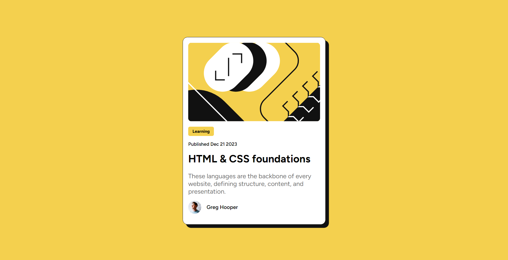

## Frontend Mentor - Blog preview card solution

### Screenshot

### Links

- Solution URL: [Add solution URL here](https://github.com/jen067/QR-code-component.git)
- Live Site URL: [Add live site URL here](https://jen067.github.io/QR-code-component/)

## My process

In this project, I have revised the content suggested by my peers regarding the QR code card:

1. Use rem instead of em for font-size, padding, and margin to scale with the viewport.
2. Use px instead of % for border-radius to fix the radius of the rounded corners.
3. Add max-width and display: block to the images to fill the container width while ensuring to set width: 100%.

## What I learned

1. Due to unfamiliarity with resetting default styles, I looked at how others set and apply them:
   (a)box-sizing: border-box; is used to ensure that padding and border are included in the element's total width, instead of adding extra space.

   (b)Set styles to prevent font inflation on different screen sizes:
   -moz-text-size-adjust: none;
   -webkit-text-size-adjust: none;
   text-size-adjust: none;

2. Set min-height on the body instead of height and apply padding or padding-inline to prevent content from sticking to the edges of the screen, especially on mobile or smaller screens.

3. Make good use of selectors:
   .blog-card > _ + _ {
   margin-top: var(--padding--sm);
   }
   This approach allows me to add uniform margins without needing extra configurations.
